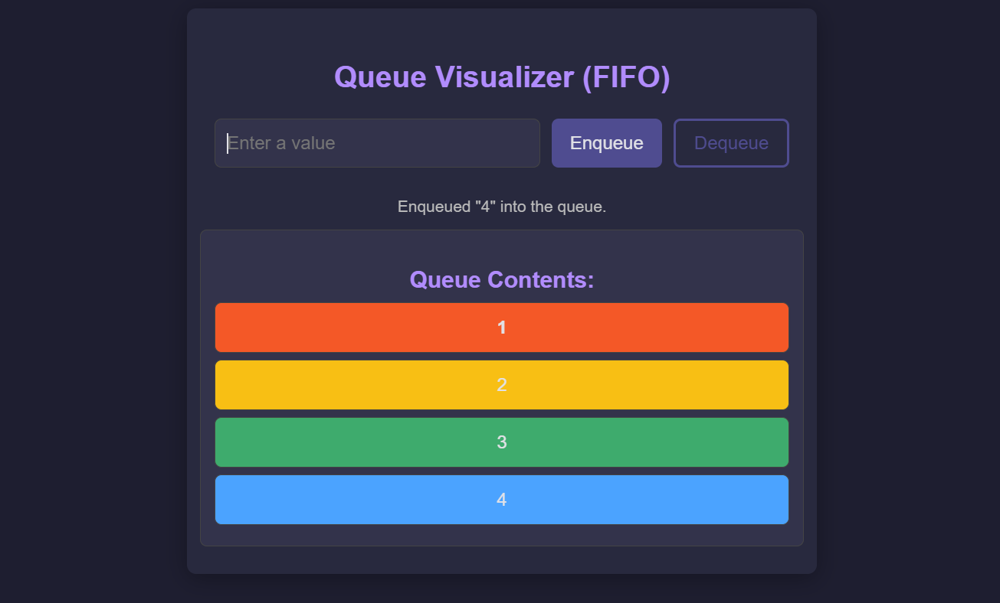

# Queue Visualizer

Queue Visualizer is a simple React application that visually demonstrates queue operations such as **enqueue** and **dequeue**. This project is a great way to understand how a queue works and to see the First In, First Out (FIFO) principle in action. The application allows users to add values to a queue, view them as they are added, and remove them from the queue.

## Table of Contents
- [Features](#features)
- [Getting Started](#getting-started)
  - [Prerequisites](#prerequisites)
- [Usage](#usage)
- [Contributing](#contributing)

## Features
- Add (Enqueue) items to the queue
- Remove (Dequeue) items from the queue
- Visualize the queue contents with color-coded items
- Displays user messages for queue operations

## Getting Started

## Demo

### Prerequisites
- [Node.js](https://nodejs.org/) installed on your machine
- [Git](https://git-scm.com/) for version control (optional)

## Usage
1. **Enter a Value**: Type a value into the input field provided at the top of the application.
2. **Enqueue**: Click the "Enqueue" button to add the value to the end of the queue. The queue follows the First In, First Out (FIFO) principle, so the first item added will be the first to be removed.
3. **Dequeue**: Click the "Dequeue" button to remove the front item from the queue. If the queue is empty, a message will display indicating that the queue is empty.
4. **Keyboard Shortcut**: You can press the **Enter** key to quickly enqueue the value entered in the input field onto the queue.

Each item in the queue is color-coded to differentiate between them, and a message is displayed below the buttons to confirm each action.

## Contributing
We welcome contributions to the Queue Visualizer project! If you would like to contribute, please follow these steps:

1. **Fork the Repository**: Go to the [Queue Visualizer repository](https://github.com/Balaji91221/queue-visualization) and click the "Fork" button to create a copy of the repository on your GitHub account.

2. **Clone the Forked Repository**: Clone the forked repository to your local machine.

